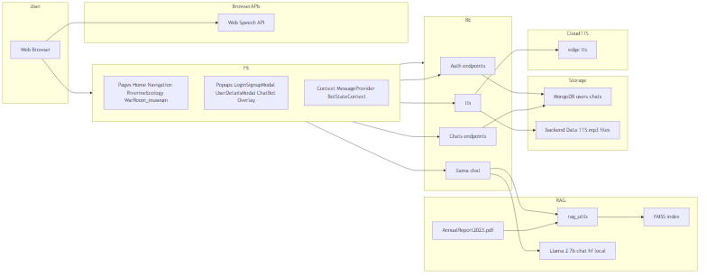
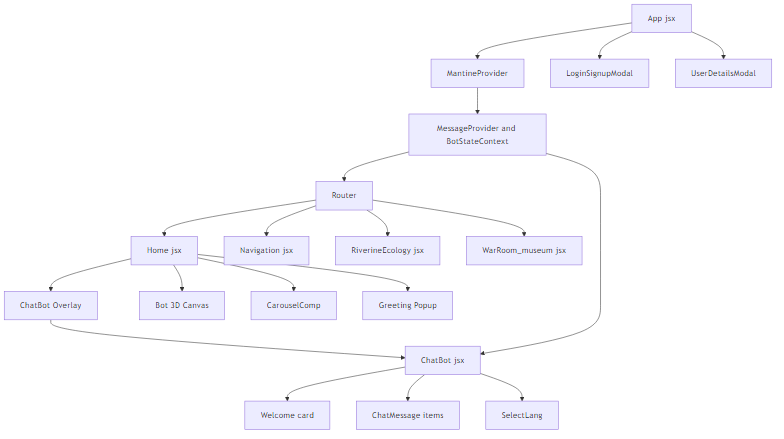
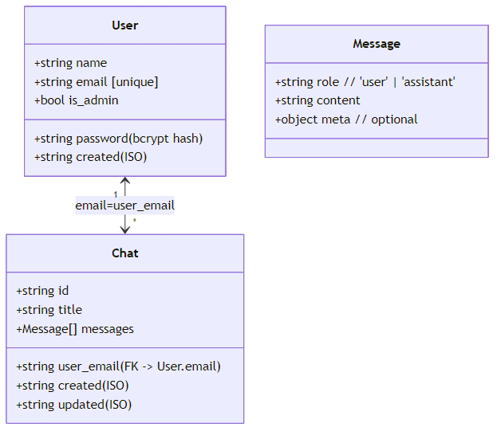
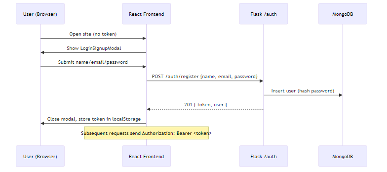
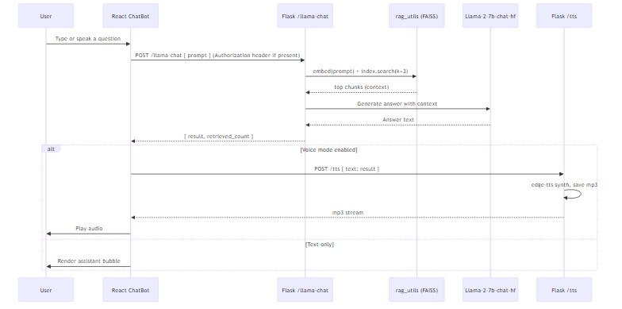
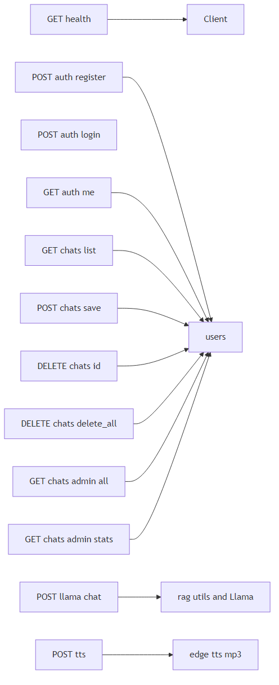

# SmartGanga Mascot — Comprehensive Project Report

This report documents the complete design and implementation of SmartGanga Mascot: an AI/ML and RAG‑Powered Robot and Digital Avatar designed to strengthen river–people connect for the Namami Gange mission. It consolidates architecture, data flows, user experience, engineering details, and references from this repository, and includes diagram images.

> Where to find sources in this repo
> - Backend: `backend/` (Flask app, RAG, LLM, TTS/STT, auth, chat persistence)
> - Frontend: `frontend/` (React app, pages, components, styles)
> - Docs + Diagrams: `docs/` and `docs/diagrams/`

---

## 1. Introduction

SmartGanga Mascot is a web portal and interactive assistant that educates and engages users—especially children and teens—about the Ganga river. It combines a domain‑adapted chatbot (RAG over official documents) with voice features and playful mini‑games, designed for museum kiosks, classrooms, and public awareness campaigns.

Key goals:
- Deliver accurate, contextual knowledge about river ecology, culture, and conservation.
- Keep data private and deployment reproducible with local inference: RAG + LLM run on‑prem.
- Adapt responses to age groups (kid/teen/adult) with safe, friendly guidance.
- Support voice I/O for accessibility and kiosk scenarios.

---

## 2. System at a glance

The browser (React) talks to a Flask API. The backend hosts a local RAG pipeline (PDF → chunks → FAISS) and a local chat model (Llama‑2 7B). Optional MongoDB persists users and chats. TTS produces audio responses the browser can play.

Main modules:
- Frontend: React 18 + Vite + Tailwind + Mantine; pages for Home, Chat, Navigation, Riverine Ecology, Games; voice playback and chat overlay.
- Backend: Flask 3.x; blueprints for auth and chats; endpoints for RAG chat, TTS/STT, health.
- RAG: `pdfplumber` for ingestion, chunking, hash‑based embeddings, FAISS index for retrieval.
- LLM: Llama‑2‑7B chat model loaded from local weights; GPU/CPU aware token/temperature settings by age‑group.
- Persistence: MongoDB with fallback to an in‑memory collection shim for local development.

---

## 3. Features

User‑facing features:
- Conversational learning with ChaCha mascot.
- Voice output (Text‑to‑Speech) and browser‑side speech input.
- Pages with curated content: Riverine Ecology, Navigation (distance/landmarks), Games (quiz + trash sorting), and a 3D avatar.
- Gamification: points, streaks, achievements, badges, and celebratory effects.

Engineering features:
- Local RAG for explainability and privacy; no external LLM APIs.
- Age‑adaptive instruction templates; greeting‑aware safe fallbacks.
- Strict CORS + JWT auth; admin analytics for chat counts.
- Defensive fallbacks when optional stacks (Torch/Transformers/Mongo/Piper) aren’t available.

---

## 4. Architecture & design

### 4.1 Architecture diagram

Explanation:
- Frontend sends JSON to Flask endpoints. `/llama-chat` performs RAG retrieval and generation.
- RAG uses FAISS to fetch top‑k text chunks from the ingested PDF, concatenated into the prompt.
- The LLM generates final answers; the server optionally calls `/tts` to synthesize audio.
- Browser plays audio and renders markdown responses.
- Persistence is optional; if MongoDB isn’t set up, the app uses an in‑memory store.

### 4.2 Frontend structure

- App → Provider contexts → Router → Pages (Home, Chat, Navigation, RiverineEcology, Games)
- Overlays: Login/Signup modal, Greeting popup, Chat overlay
- Components: NavBar, ChatMessage (markdown), ProgressBar, Badge, Carousel, 3D Bot canvas

### 4.3 Data model

- Users: { name, email [unique], password_hash, is_admin, created }
- Chats: { id, user_email, title, messages[], created, updated }
- Messages: { role (‘user’|‘assistant’), content, meta? }

MongoDB indexes:
- users: unique(email)
- chats: unique(user_email, id); index(user_email)

### 4.4 Workflows

Auth (register/login/me):

Chat with RAG + optional TTS:

REST endpoints map:

---

## 5. Backend implementation (summary)

Location: `backend/`

- App factory & CORS: `backend/app.py` registers blueprints and exposes `/`, `/health`, `/llama-chat`, `/tts`, `/stt`, `/voices`, and optional `/fast-tts`/`/fast-stt` when helpers are present.
- Auth: `backend/auth.py` uses PyJWT (HS256) with configurable expiry; Werkzeug password hashing; ephemeral fallback `SECRET_KEY` in dev.
- Chat persistence: `backend/chat_routes.py` exposes CRUD endpoints; enforces single “Welcome Chat” per user by title; provides admin stats.
- RAG utilities: `backend/rag_utils.py` ingests `Data/AnnualReport2023.pdf` at import, chunks, embeds (hash‑based), builds FAISS index.
- LLM: local Llama‑2 7B weights (`backend/Llama-2-7b-chat-hf/`); age‑aware temperature/token settings; greeting shortcuts; history truncation to last 8 turns.
- TTS/STT: `POST /tts` supports engines (edge‑tts fast path for English, Piper WAV output). STT is browser‑side; server `/stt` is an echo endpoint.
- Health: `/health` surface flags for RAG/LLM/TTS readiness and DB mode.

Key robustness patterns:
- Defensive imports for Transformers/Torch, Piper, Mongo with graceful degradation.
- Unique filenames (UUID) for audio to handle concurrency.
- Request preflight fast‑path for CORS on `/llama-chat`.

---

## 6. Frontend implementation (summary)

Location: `frontend/`

- Vite config proxies `/api` → Flask at `http://127.0.0.1:5000`.
- Pages:
  - Home: Overview, chat overlay, 3D Bot, stats and contact.
  - Chat: Full‑screen chat with React markdown rendering (tables supported).
  - Navigation: Haversine distance calculator; locate Ganga Aarti; user geolocation centering.
  - Riverine Ecology: Visual facts and guidance; prompts to “ask the chat”.
  - Games: Ganga Quiz and Trash Sorting with streaks and badges.
- Components: NavBar (responsive menu), ChatMessage (markdown), ProgressBar, Badge, Carousel, Loaders.
- 3D Bot: React Three Fiber + drei; toggled “speaking” animation linked to voice playback.

User experience details:
- Age‑friendly copy and visuals.
- Voice playback of TTS responses; optional STT input (via browser API client‑side).
- Gamified reinforcement for kids: points, streaks (3‑day, 7‑day), badge cabinet, confetti.

---

## 7. Configuration & deployment

Environment variables:
- CORS: `FRONTEND_URL`
- Auth: `SECRET_KEY`, `ADMIN_CODE`, `TOKEN_EXP_HOURS`
- Mongo: `MONGODB_URI`, `MONGODB_DB`
- RAG/LLM: `LLAMA_ALLOW_FALLBACK_WITHOUT_RAG`, `LLAMA_FORCE_FALLBACK`, `LLAMA_MAX_NEW_TOKENS`, `LLAMA_MAX_INPUT_TOKENS`, `RAG_CONTEXT_CHARS`
- TTS: `TTS_ENGINE`, `PIPER_PATH`, `PIPER_VOICES_DIR`

Backend dependencies: see `backend/requirements.txt` (Flask, numpy, pdfplumber, PyJWT, edge‑tts; optional pymongo)

Frontend dependencies: see `frontend/package.json` (React, Vite, Tailwind, Mantine, markdown, axios, react‑router, three, etc.)

Windows reproducibility: `docs/reproducibility_windows.md` (step‑by‑step setup, testing, and troubleshooting).

Docker: root `Dockerfile` prepares a CUDA‑enabled image; mount `backend/Data` and `backend/Llama-2-7b-chat-hf/` for inference.

---

## 8. Testing & evaluation

Manual tests:
- Auth: register/login; token stored; protected endpoints succeed.
- RAG: `/llama-chat` returns answers with `retrieved_count`>0; validate relevance qualitatively.
- Voice: `/tts` returns audio; headers include voice/engine; playback works in browser.
- Games: complete quiz and trash sort; verify points, streaks, and badges.

Metrics (planned/optional):
- Latency (ms) from app logs; token streaming (future).
- Retrieval hit‑rate (simple sampling or human evaluation).
- Resource usage (CPU/GPU/memory) during chat and TTS.

---

## 9. Limitations & future work

- Replace hash embeddings with Sentence‑Transformers; consider reranking for quality.
- Add token streaming for faster perceived latency and responsiveness.
- Broader multilingual support (voices, UI) and improved STT UX.
- Multi‑document ingestion and an admin CMS for content updates.
- More automated tests (unit/integration) and load/regression testing.

---

## 10. References

Internal sources:
- `backend/app.py`, `backend/auth.py`, `backend/chat_routes.py`, `backend/db.py`, `backend/rag_utils.py`
- `frontend/src/*`, `frontend/vite.config.js`, `frontend/tailwind.config.js`
- `docs/*`, `docs/diagrams/*`

External docs (see `docs/references.bib`): Flask, React, FAISS, pdfplumber, edge‑tts, MongoDB, Sentence‑Transformers.

---

## Appendix A: REST API overview

- Auth: `/auth/register`, `/auth/login`, `/auth/me`
- Chats: `/chats/` (list), `/chats/save`, `/chats/{id}`, `/chats/delete_all`, admin variants
- RAG + LLM: `/llama-chat`
- Speech: `/tts` (TTS); `/stt` (echo; STT runs in browser); optional `/fast-tts`, `/fast-stt`
- Health: `/health`

---

## Appendix B: How diagrams are generated

Mermaid diagram sources live in `docs/diagrams/*.mmd`. PNGs stored alongside this report are rendered from these `.mmd` files. If you ever need to re‑generate PNGs, use Mermaid CLI (`@mermaid-js/mermaid-cli`) and export each `.mmd` to `.png`.
