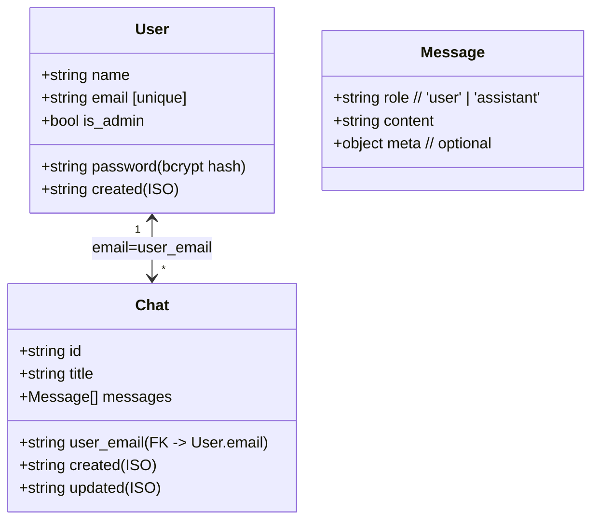
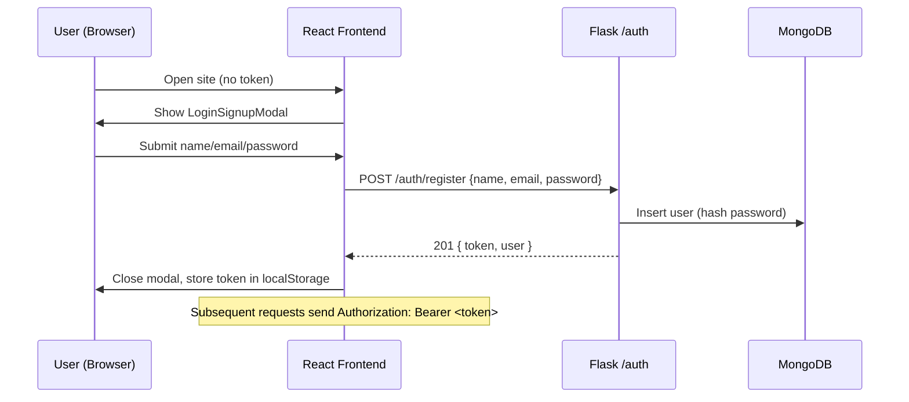
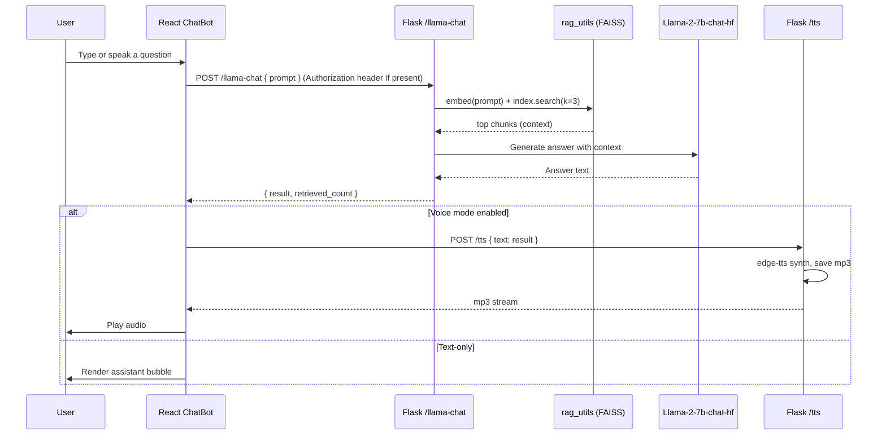

## System architecture and workflows (web only)

This document provides visual diagrams of your current web app (excluding the mobile app), including the React frontend pages and popups, Flask backend, MongoDB, RAG pipeline, and request flows. You can preview these Mermaid diagrams directly in VS Code (with a Mermaid preview extension) or paste them into https://mermaid.live to export PNG/SVG.

---

### PNG exports (ready-made images)

Once generated, PNGs will appear here:

- Architecture: `docs/diagrams/architecture.png`
- Frontend pages/components: `docs/diagrams/frontend.png`
- Data model: `docs/diagrams/data-model.png`
- Auth workflow: `docs/diagrams/auth-flow.png`
- Chat + RAG + TTS workflow: `docs/diagrams/chat-flow.png`
- Endpoints map: `docs/diagrams/endpoints.png`

If these files are not present yet, ask me to “generate the PNGs” and I’ll produce them for you automatically.

---

## 🌐 High-level system architecture

```mermaid
flowchart LR
  subgraph User[User]
    B[Web Browser]
  end

  subgraph FE[React Frontend (Vite)]
    PAGES[Pages: Home, Navigation, RiverineEcology, WarRoom_museum]
    POPUPS[Popups/Modals: LoginSignupModal, UserDetailsModal, ChatBot Overlay]
    CONTEXT[Context: MessageProvider, BotStateContext]
  end

  subgraph BE[Flask Backend]
    AUTH[/auth: register, login, me/]
    CHATS[/chats: list, save, delete, admin/]
    LLM[/llama-chat/]
    TTS[/tts/]
  end

  subgraph RAG[RAG + LLM]
    PDF[(Data/AnnualReport2023.pdf)]
    CHUNKS[rag_utils: extract + chunk]
    FAISS[(FAISS index)]
    Llama[Llama-2-7b-chat-hf (local)]
  end

  subgraph Storage[Storage]
    MONGO[(MongoDB: users, chats)]
    DATADIR[(backend/Data: TTS mp3 files)]
  end

  subgraph BrowserAPIs[Browser-side speech]
    STT[Web Speech API (speech-to-text in browser)]
  end

  subgraph CloudTTS[Edge TTS]
    EDGETTS[edge-tts (Microsoft online voices)]
  end

  B --> FE
  FE -->|Axios fetch| BE

  AUTH --> MONGO
  CHATS --> MONGO

  LLM --> CHUNKS
  CHUNKS --> FAISS
  PDF --> CHUNKS
  LLM --> Llama

  TTS --> DATADIR
  TTS --> EDGETTS

  FE -->|/llama-chat (prompt)| LLM
  FE -->|/auth/* (register/login/me)| AUTH
  FE -->|/chats/* (optional persistence)| CHATS
  FE -->|/tts (text->mp3)| TTS

  B -->|Microphone| STT
  FE -. plays mp3 .-> B
```

Notes:
- MongoDB URI/DB come from env variables; if unavailable, the backend falls back to an in-memory store for dev.
- TTS uses `edge-tts` to synthesize voice (downloads mp3s into `backend/Data/`).
- STT is performed client-side via the browser (no server-side STT).

---

## 🧭 Frontend pages, popups, and component hierarchy

```mermaid
flowchart TD
  APP[App.jsx]
  MP[MantineProvider]
  CTX[MessageProvider + BotStateContext]
  RT[Router]

  APP --> MP --> CTX --> RT
  RT -->|/| HOME[Home.jsx]
  RT -->|/home| HOME
  RT -->|/navigation| NAV[Navigation.jsx]
  RT -->|/riverine_ecology| RE[RiverineEcology.jsx]
  RT -->|/warRoom_museum| WM[WarRoom_museum.jsx]

  %% Popups rendered by App/Home
  APP --> LSM[LoginSignupModal]
  APP --> UDM[UserDetailsModal]
  HOME --> CHATPOP[ChatBot Overlay]

  %% Home internals
  HOME --> BOT[Bot (3D/Canvas)]
  HOME --> CAR[CarouselComp]
  HOME --> GREET[Greeting Popup]

  %% Chat overlay internals
  CHATPOP --> CHATBOT[ChatBot.jsx]
  CHATBOT --> WELCOME[Welcome card]
  CHATBOT --> CMSG[ChatMessage items]
  CHATBOT --> SEL[SelectLang]

  %% Context usage
  CTX -->|provides| CHATBOT
```

Behavior highlights:
- On first load, `LoginSignupModal` opens if no token in localStorage.
- `Home` autoplays a greeting and dispatches a custom event to activate the ChatBot voice.
- The “Chat” button slides the Bot and opens the ChatBot overlay.

---

## 🗂️ Data model (MongoDB)



Indexes (db.py):
- users: unique index on `email`
- chats: unique composite index on `(user_email, id)` and index on `user_email`

Fallback: If MongoDB is unavailable, an in-memory collection is used (good for dev/testing).

---

## 🔐 Auth workflow (register/login and token usage)



Token validation on protected routes is handled by `@token_required` (and `@admin_required` for admin endpoints).

---

## 💬 Chat workflow with RAG and TTS



Notes:
- STT is handled entirely in the browser via `react-speech-recognition` (Web Speech API). No audio is uploaded to the server.
- TTS is synthesized server-side via `edge-tts`; mp3s are stored under `backend/Data/` with unique filenames.

---

## 🧰 Backend endpoints overview

```mermaid
flowchart LR
  A[/GET /health/] -->|status| B[Client]
  C[/POST /auth/register/] --> D[(users)]
  E[/POST /auth/login/]
  F[/GET /auth/me/] --> D

  G[/GET /chats/ (auth)] --> D
  H[/POST /chats/save (auth)] --> D
  I[/DELETE /chats/:id (auth)] --> D
  J[/DELETE /chats/delete_all (auth)] --> D

  K[/GET /chats/admin/all (admin)] --> D
  L[/GET /chats/admin/stats (admin)] --> D

  M[/POST /llama-chat/] --> N[rag_utils + Llama]
  O[/POST /tts/] --> P[edge-tts -> mp3]
```

Auth-required endpoints use `Authorization: Bearer <token>`.

---

## How to export as images

- Quickest: open https://mermaid.live, paste any code block, then Export -> PNG/SVG.
- VS Code: install a Mermaid preview extension (e.g., “Markdown Preview Mermaid Support”), open this file, then use its export command to save PNG/SVG.

---

If you want a single consolidated PNG with all sections, tell me which diagrams to combine and I’ll generate a merged version.
